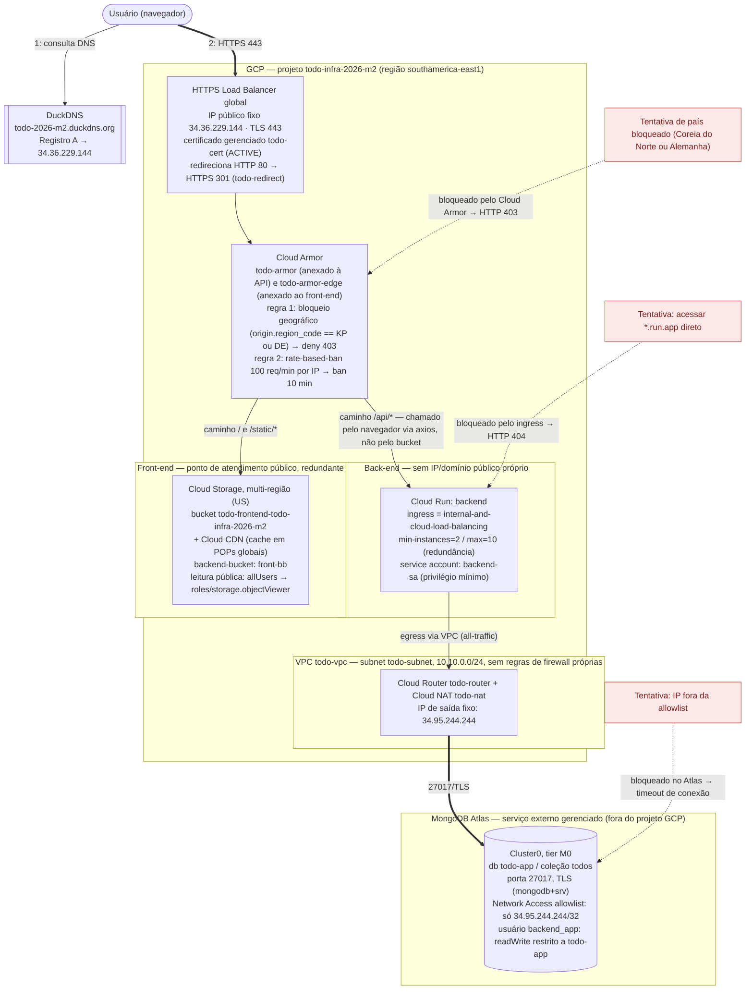

# Diagrama técnico — Arquitetura da aplicação (Entrega 2)

Este arquivo é ao mesmo tempo a **versão legível** (renderiza como diagrama em qualquer visualizador
Mermaid — GitHub, VS Code, `mermaid.live`) e o **arquivo-fonte editável** do diagrama: é só texto.

Todos os nomes de recurso abaixo são reais, verificados ao vivo contra o projeto GCP
`todo-infra-2026-m2` nesta sessão (não copiados de documentação antiga sem checar). O diagrama do
pipeline de observabilidade (fontes de log/métrica → coleta → armazenamento → painel, e quem pode
consultar) está em [`diagrama-observabilidade.md`](./diagrama-observabilidade.md) — os nós
`CloudRun` (backend) e `Armor` (Cloud Armor) aparecem nos dois diagramas com o mesmo nome, para
deixar a relação entre os dois explícita.

## Legenda

| Estilo | Significado |
|---|---|
| Seta fina `-->` | Consulta DNS (troca de metadado, não é tráfego HTTP) |
| Seta grossa `==>` | Tráfego de aplicação permitido (HTTPS/TLS) |
| Seta tracejada vermelha `-.->`, caixa vermelha | Tentativa de acesso bloqueada, com o ponto exato onde o bloqueio ocorre |
| Retângulo | Recurso do GCP administrado pelo grupo |
| Cilindro | Banco de dados |
| Subgraph "VPC" | Rede privada — nenhum componente ali aceita conexão de entrada da internet |

## Notas de fidelidade (o que foi corrigido nesta entrega em relação à Entrega 1)

- **IAM do Cloud Run (`backend`)**: `roles/run.invoker` está concedido a `allUsers`, não só ao Load
  Balancer. Isso foi investigado nesta sessão com a documentação oficial do Google Cloud: um Load
  Balancer HTTPS **externo** usando Serverless NEG **sem Identity-Aware Proxy (IAP)** não anexa
  nenhum token de identidade às requisições que repassa — não existe uma "identidade do LB" para
  restringir com IAM sem adicionar IAP (fora do escopo aqui). Por isso `allUsers` é **exigido**
  para o tráfego do Load Balancer funcionar, e não é uma falha de configuração. O controle real
  contra acesso direto é só o `ingress = internal-and-cloud-load-balancing`, confirmado ao vivo
  (`curl` direto na URL `*.run.app` → HTTP 404). A documentação da Entrega 1 afirmava o contrário;
  esta é a versão corrigida.
- **Firewall da VPC `todo-vpc`**: não existe nenhuma regra de firewall própria nessa rede (só as
  regras padrão da rede `default`, que é outra rede, não utilizada). Isso é intencional e correto:
  como nada dentro da VPC aceita conexões de entrada (o Cloud Run usa Direct VPC Egress só para
  *sair* através do NAT), o padrão implícito de "negar tudo que não foi liberado" de uma VPC em
  modo customizado já é suficiente — não há necessidade de regra explícita.
- **Log do Load Balancer**: habilitado no `api-bs` (backend-service da API) nesta entrega, para
  alimentar o painel de origem geográfica (ver `diagrama-observabilidade.md`). **Não foi possível
  habilitar no `front-bb`** (backend-bucket do front-end, que serve arquivos estáticos do Cloud
  Storage) — testado via API do Compute Engine (v1 e beta, PATCH e PUT) e o campo `logConfig`
  simplesmente não é aplicado nesse tipo de backend. Isso é uma limitação da plataforma, não uma
  escolha do grupo — é o tipo de coisa que o enunciado pede para sinalizar explicitamente quando
  algo é administrado pelo provedor e não está disponível.
