# Diagrama técnico — Pipeline de observabilidade (Entrega 2)

Versão legível **e** arquivo-fonte editável (Mermaid). Complementa
[`diagrama-arquitetura.md`](./diagrama-arquitetura.md) — os nós `CloudRun` e `Armor` são os mesmos
recursos nos dois diagramas. Mostra, para cada dado observado, a cadeia completa: **componente que
gera o dado → coleta/encaminhamento → armazenamento/consulta → painel**, e quem pode acessar os
painéis.

```mermaid
flowchart LR
    subgraph App["Aplicação — mesmos recursos do diagrama de arquitetura"]
        CloudRun["Cloud Run: backend<br/>emite 1 linha JSON por evento no stdout<br/>(http_request, db_operation, business_event)"]
        Armor["Load Balancer + Cloud Armor (api-bs)<br/>logConfig habilitado<br/>registra país de origem e decisão (aceito/negado)"]
        Uptime["Uptime Check gerenciado pelo GCP<br/>sonda https://todo-2026-m2.duckdns.org/<br/>e .../api/health a cada 5 min, de fora do projeto"]
    end

    subgraph Collect["Coleta — Cloud Logging (gerenciado pelo GCP, sem agente instalado)"]
        CloudLogging["Cloud Logging<br/>ingestão automática do stdout do Cloud Run<br/>e dos logs de requisição do Load Balancer<br/>reconhece campos especiais (severity, time)"]
    end

    subgraph Store["Armazenamento + cálculo — Cloud Monitoring<br/>(mesmo pacote gerenciado do Google Cloud Observability que o Cloud Logging;<br/>log-based metrics é a ponte entre os dois — reúne coleta+armazenamento+consulta num único serviço)"]
        LogMetrics["Log-based Metrics (6):<br/>app_http_requests, app_http_request_duration,<br/>app_db_operations, app_db_operation_duration,<br/>app_business_events, lb_requests_by_region"]
        CloudMonitoring["Cloud Monitoring<br/>séries temporais (contadores e distribuições)<br/>+ métricas nativas de Uptime Check<br/>+ métricas nativas do Cloud Run (CPU/memória/instâncias)"]
    end

    subgraph ViewBox["Consulta / apresentação"]
        SA["Service account grafana-viewer-sa<br/>roles/monitoring.viewer — só leitura<br/>chave usada apenas na configuração do data source"]
        Grafana["Grafana Cloud (SaaS)<br/>data source: Google Cloud Monitoring<br/>4 painéis fundamentados: banco, disponibilidade, origem geográfica, bloqueios por abuso<br/>+ 1 painel de referência operacional (bastidores, em 3 sub-painéis)<br/>8 painéis no total"]
    end

    CloudRun -->|"stdout, JSON estruturado"| CloudLogging
    Armor -->|"log de requisição do LB, 1 por request"| CloudLogging
    CloudLogging -->|"filtro + extração de campos"| LogMetrics
    LogMetrics --> CloudMonitoring
    Uptime -->|"resultado sucesso/falha + latência"| CloudMonitoring
    CloudMonitoring -->|"consulta autenticada"| SA
    SA --> Grafana

    Access["Quem acessa os painéis?"] -.->|"login/gestão de usuários nativa do Grafana Cloud<br/>(controle separado do IAM do GCP)"| Grafana
```

## Legenda

| Estilo | Significado |
|---|---|
| Seta sólida fina | Fluxo de dado de observabilidade (geração → coleta → armazenamento → painel) |
| Seta tracejada | Relação de controle de acesso (quem pode ver o quê), não um fluxo de dado |
| Subgraph | Uma etapa da cadeia; quando várias etapas caem no mesmo serviço gerenciado do GCP, isso é indicado no próprio título do subgraph |

## Pontos que o enunciado pede para deixar explícitos

- **Retenção**: Cloud Logging retém os logs brutos por ~30 dias (bucket `_Default`, configuração
  padrão do projeto, não alterada por este trabalho). As séries temporais do Cloud Monitoring
  (log-based metrics, Uptime Check, métricas nativas do Cloud Run) são retidas por mais tempo,
  conforme o padrão do próprio Cloud Monitoring — isso é administrado pelo GCP, não configurável
  pelo grupo.
- **Quem pode consultar**: o acesso aos painéis é controlado pelo **login do Grafana Cloud**
  (conta/organização do Grafana, independente do IAM do GCP). A `grafana-viewer-sa` é uma
  identidade técnica (só leitura no Cloud Monitoring), não um usuário — ela não decide quem entra
  no Grafana, só o que o Grafana pode consultar depois que alguém já está autenticado nele.
- **Serviço gerenciado reunindo várias funções**: Cloud Logging (coleta) e Cloud Monitoring
  (armazenamento + consulta) são dois produtos do mesmo pacote "Google Cloud Observability" —
  nenhum dos dois exige VM, agente ou administração de storage por parte do grupo.
- **Limitação conhecida e sinalizada**: o backend-bucket do front-end (`front-bb`, arquivos
  estáticos no Cloud Storage) **não** gera log de requisição — testado nesta sessão e confirmado
  como limitação da plataforma (o campo `logConfig` não é aplicável a esse tipo de backend). Por
  isso o painel de origem geográfica reflete só o tráfego de API (`api-bs`), não os acessos aos
  arquivos estáticos do front-end.
- **Painel de referência operacional**: CPU, memória e contagem de instâncias do Cloud Run
  aparecem no Grafana como "Bastidores" (em 3 sub-painéis: CPU, memória, instâncias), separado dos
  4 painéis fundamentados de aplicação/usuário (banco, disponibilidade, origem geográfica,
  bloqueios por abuso) — decisão explícita do usuário, fora da restrição original de "sem
  métricas de infraestrutura" que orientou os outros painéis, e por isso tratado à parte (sem a
  fundamentação de 10 itens dos demais).
